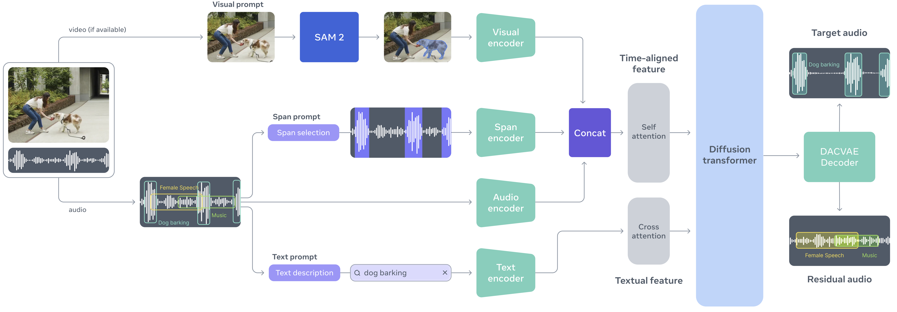

<div align="center">

# SAM-Audio




</div>

Segment Anything Model for Audio

SAM-Audio is a foundation model for isolating any sound in audio using text, visual, or temporal prompts. It can separate specific sounds from complex audio mixtures based on natural language descriptions, visual cues from video, or time spans.

## Setup

**Requirements:**
- Python >= 3.10
- CUDA-compatible GPU (recommended)

Install dependencies:

```bash
pip install .
```

## Usage

⚠️ Before using SAM Audio, please request access to the checkpoints on the SAM Audio
Hugging Face [repo](https://huggingface.co/facebook/sam-audio). Once accepted, you
need to be authenticated to download the checkpoints. You can do this by running
the following [steps](https://huggingface.co/docs/huggingface_hub/en/quick-start#authentication)
(e.g. `hf auth login` after generating an access token.)

### Available Models

- `facebook/sam-audio-1b` - 1 billion parameter model
- `facebook/sam-audio-3b` - 3 billion parameter model (recommended)

### Basic Text Prompting

```python
from sam_audio import SAMAudio, SAMAudioProcessor
import torchaudio

model = SAMAudio.from_pretrained("facebook/sam-audio-3b")
processor = SAMAudioProcessor.from_pretrained("facebook/sam-audio-3b")
model = model.eval().cuda()

file = "<audio file>" # audio file path or torch tensor
description = "<description>"

batch = processor(
    audios=[file],
    descriptions=[description],
).to("cuda")

result = model.separate(batch)

# Save separated audio
sample_rate = processor.audio_sampling_rate
torchaudio.save("target.wav", result.target.cpu(), sample_rate)      # The isolated sound
torchaudio.save("residual.wav", result.residual.cpu(), sample_rate)  # Everything else
```

### Prompting Methods

SAM-Audio supports three types of prompts:

1. **Text Prompting**: Describe the sound you want to isolate using natural language
   ```python
   processor(audios=[audio], descriptions=["A man speaking"])
   ```

2. **Visual Prompting**: Use video frames and masks to isolate sounds associated with visual objects
   ```python
   processor(audios=[video], descriptions=[""], masked_videos=processor.mask_videos([frames], [mask]))
   ```

3. **Span Prompting**: Specify time ranges where the target sound occurs
   ```python
   processor(audios=[audio], descriptions=["A horn honking"], anchors=[[["+", 6.3, 7.0]]])
   ```

See the [examples](examples) directory for more detailed examples

# Models

Below is a table of each of the models we released along with their overall subjective evaluation scores

| Model    | General SFX | Speech | Speaker | Music | Instr(wild) | Instr(pro) |
|----------|-------------|--------|---------|-------|-------------|------------|
| [`sam-audio-small`](https://huggingface.co/facebook/sam-audio-small) | 3.62        | 3.99   | 3.12    | 4.11  | 3.56        | 4.24       |
| [`sam-audio-base`](https://huggingface.co/facebook/sam-audio-base)   | 3.28        | 4.25   | 3.57    | 3.87  | 3.66        | 4.27       |
| [`sam-audio-large`](https://huggingface.co/facebook/sam-audio-large) | 3.50        | 4.03   | 3.60    | 4.22  | 3.66        | 4.49       |

We additional release another variant (in each size) that performs better specifically on visual prompting:
- [`sam-audio-small-tv`](https://huggingface.co/facebook/sam-audio-small-tv)
- [`sam-audio-base-tv`](https://huggingface.co/facebook/sam-audio-base-tv)
- [`sam-audio-large-tv`](https://huggingface.co/facebook/sam-audio-large-tv)

## Evaluation

See the [eval](eval) directory for instructions and scripts to reproduce results from the paper

## Contributing

See [contributing](CONTRIBUTING.md) and [code of conduct](CODE_OF_CONDUCT.md) for more information.

## License

This project is licensed under the SAM License - see the [LICENSE](LICENSE) file for details.
